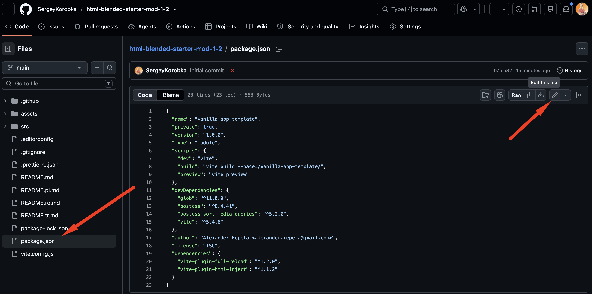
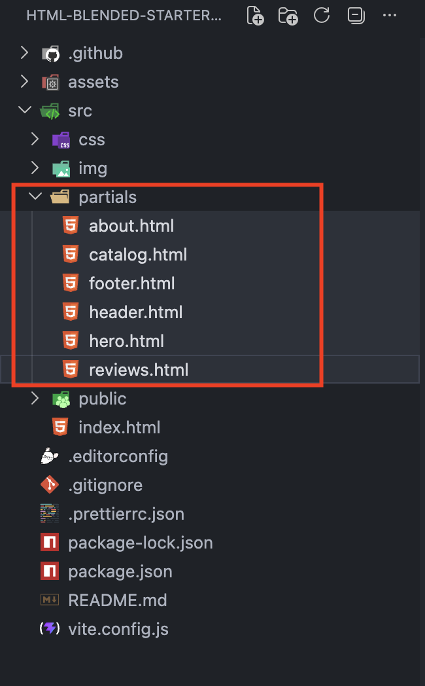
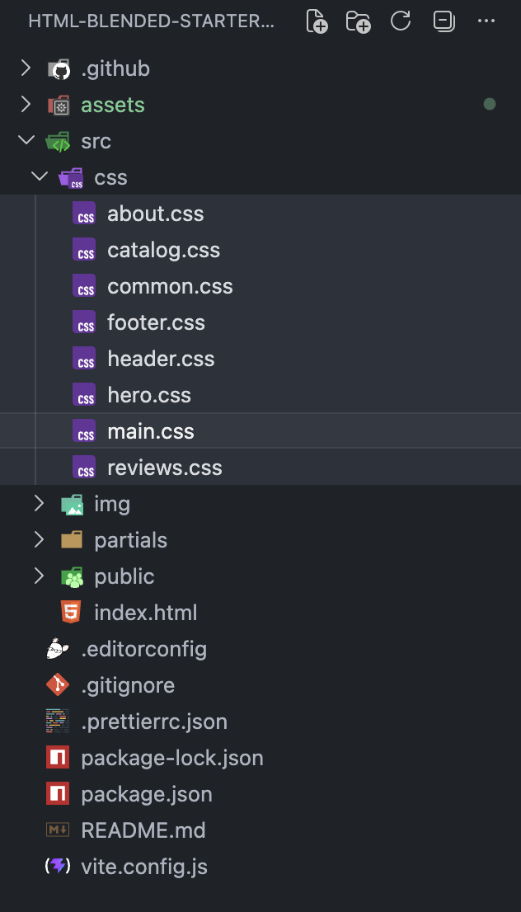
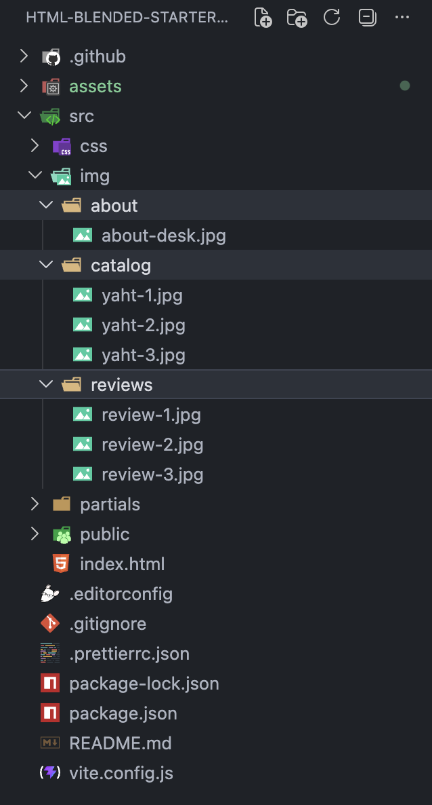
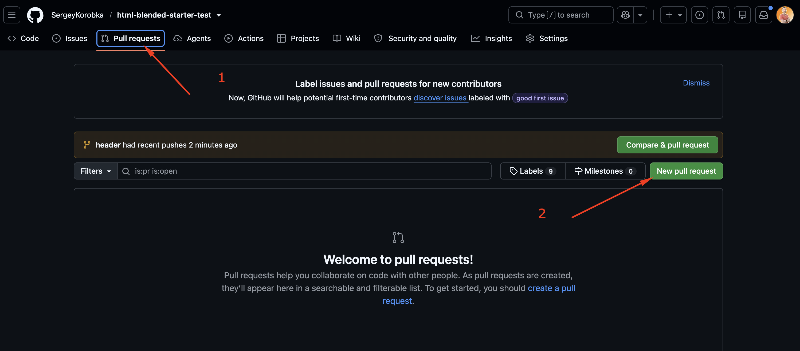
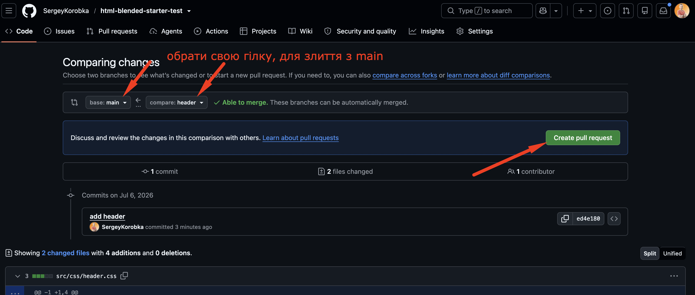
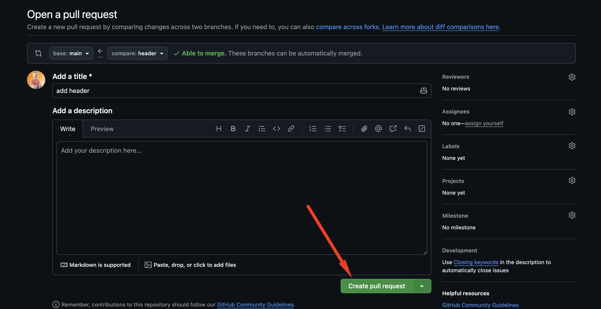
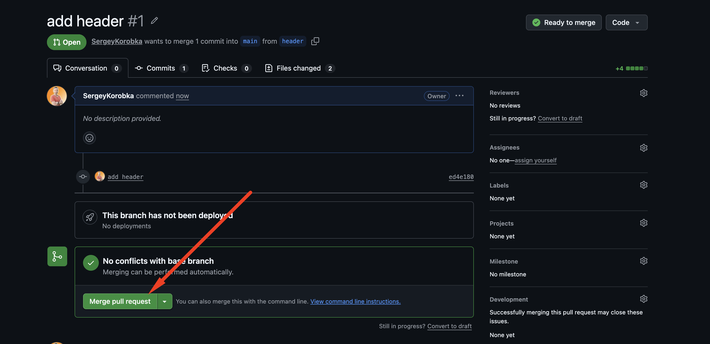
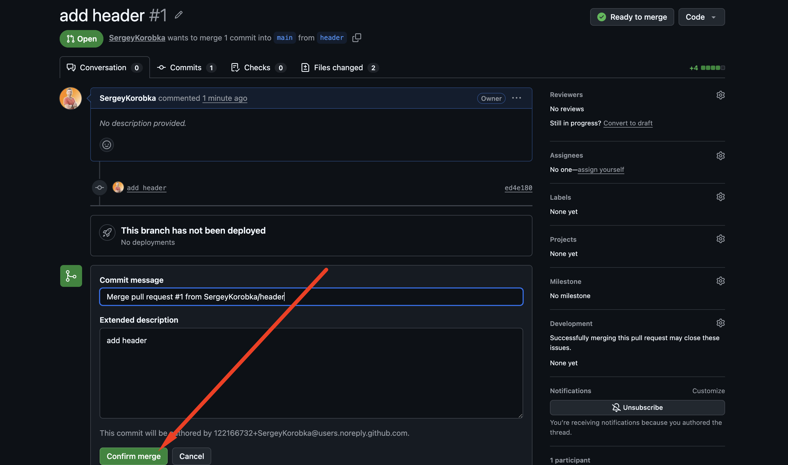
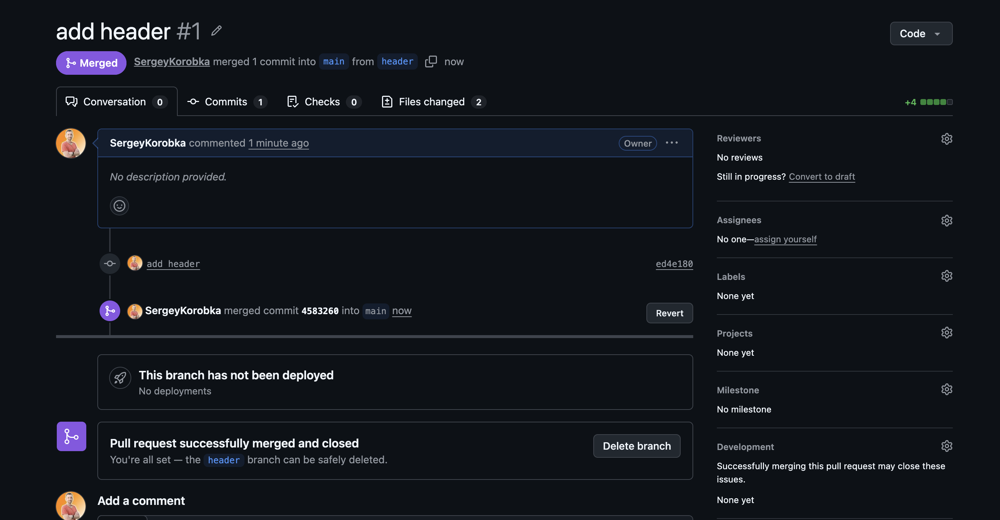

# Шаблон командного проєкту (Vite)

Цей шаблон створено на базі Vite та підготовлено для виконання командного завдання на blended заняттях.
У ньому вже налаштована базова структура папок та організація файлів для комфортної роботи декількох розробників одночасно.

## Створення репозиторію за шаблоном

Використовуй цей репозиторій організації GoIT як шаблон для створення
репозиторію свого проекту. Для цього натисни на кнопку `«Use this template»` і
обери опцію `«Create a new repository»`, як показано на зображенні.


На наступному етапі відкриється сторінка створення нового репозиторію. Заповни
поле його імені, переконайся, що репозиторій публічний, після чого натисни
кнопку `«Create repository from template»`.


Після того, як репозиторій буде створено, необхідно перейти в налаштування
створеного репозиторію на вкладку `Settings` > `Actions` > `General` як показано
на зображенні.


Проскроливши сторінку до самого кінця, в секції `«Workflow permissions»` обери
опцію `«Read and write permissions»` і постав галочку в чекбоксі. Це необхідно
для автоматизації процесу деплою проекту.


Тепер у тебе є особистий репозиторій проекту, зі структурою файлів та папок
репозиторію-шаблону. Далі працюй з ним, як з будь-яким іншим особистим
репозиторієм, клонуй його собі на комп'ютер, пиши код, роби коміти та відправляй
їх на GitHub.

## Деплой

Продакшн версія проекту буде автоматично збиратися та деплоїтись на GitHub
Pages, у гілку `gh-pages`, щоразу, коли оновлюється гілка `main`. Наприклад,
після прямого пуша або прийнятого пул-реквесту. Для цього необхідно у файлі
`package.json` змінити значення прапора `--base=/<REPO>/`, для команди `build`,
замінивши `<REPO>` на назву свого репозиторію, та відправити зміни на GitHub.

```json
"build": "vite build --base=/<REPO>/",
```

Відкриваємо на гітхабі файл package.json та натискаємо edit для внесення змін.


Додаємо в `--base=/<REPO>/` назву свого репозиторія.
Назва репозиторію в `--base` повинна повністю збігатися з назвою репозиторію на GitHub.


Далі необхідно зайти в налаштування GitHub-репозиторію (`Settings` > `Pages`) та
виставити роздачу продакшн версії файлів з папки `/root` гілки `gh-pages`, якщо
це не було зроблено автоматично.


## Додавання учасників до проєкту

Після завершення всіх налаштувань необхідно додати всіх учасників команди до репозиторію.

Кожен учасник отримає права на створення власних гілок, виконання комітів та створення Pull Request.

Для цього перейдіть у налаштування репозиторію на вкладку `Settings` → `Collaborators`, натисніть кнопку `Add people`, як показано на зображенні, та в полі пошуку введіть email або nickname користувача, якого потрібно запросити.


Після надсилання запрошення учасник отримає його електронною поштою або в розділі повідомлень GitHub. Щоб отримати доступ до репозиторію, необхідно прийняти це запрошення (`Accept invitation`).

## Підготовка до роботи

1. Переконайся, що на комп'ютері встановлено LTS-версію Node.js.
   [Скачай та встанови](https://nodejs.org/en/) її якщо необхідно.
2. Встанови базові залежності проекту в терміналі командою `npm install`.
3. Запусти режим розробки, виконавши в терміналі команду `npm run dev`.
4. Перейдіть у браузері за адресою
   [http://localhost:5173](http://localhost:5173). Ця сторінка буде автоматично
   перезавантажуватись після збереження змін у файли проекту.

## Файли і папки
Кожен учасник команди працює лише зі своїм HTML-файлом та своїм CSS-файлом. Це дозволяє уникнути конфліктів під час об'єднання змін.

Файли розмітки компонентів під кожну секцію сторінки знаходяться в папці
`src/partials`, кожен розробник працює тільки в своєму файлі.


Файли стилів знаходяться в папці `src/css` та імпортуються в головний файл
`main.css`, кожен розробник працює тільки в своєму файлі.


Зображення додані до папки `src/img` у відповідні підпапки з назвою секції.


Особливості підключення зображень:
При використанні Vite всі зображення, що знаходяться в папці `src/img`, підключаються через абсолютний шлях відносно папки `src`.
Наприклад:

```html

```

## Робота з гілками

1. Перед початком роботи необхідно створити окрему гілку. Для цього виконайте в терміналі команду:
   `git switch -c назва_гілки`
   Назва гілки повинна відповідати секції, над якою ви працюєте.
2. Виконайте свою частину завдання.
3. Після завершення роботи збережіть зміни та відправте їх до свого репозиторію, виконавши послідовно такі команди:
   `git add --all`
   `git commit -m "Completed назва_гілки section"`
   `git push -u origin назва_гілки`
4. Після відправлення гілки на GitHub необхідно створити **Pull Request** та об'єднати свої зміни з гілкою `main`. Для цього виконайте наступні кроки:
   Перейдіть на вкладку `Pull requests` та натисніть кнопку `New pull request`.
   

   У списку гілок оберіть:
   - ліворуч — гілку `main`;
   - праворуч — свою робочу гілку.
   Після цього натисніть кнопку `Create pull request`.
   

   За потреби змініть назву Pull Request або додайте його опис, після чого натисніть `Create pull request`.
   

   Натисніть кнопку `Merge pull request`.
   

   Підтвердіть злиття, натиснувши `Confirm merge`.
   

   Після успішного злиття Pull Request ваші зміни будуть додані до гілки `main`.
   